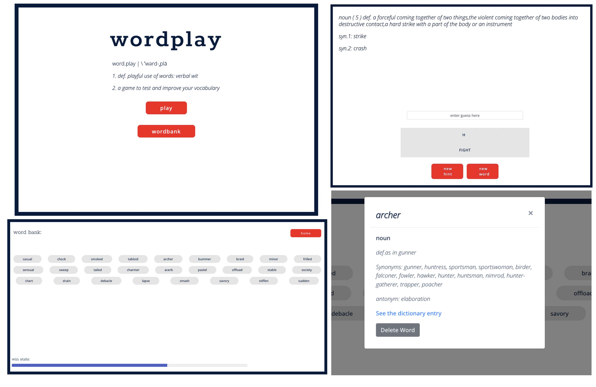

# Word-Game

## About This Project
Wordplay is the word-game that tests your vocabulary not luck.

In this word guessing game, players guess randomly generated words with clues based on that words entry in the Merriam-Webster Thesaurus. Random words are limited to  5-7 characters long, and with a sufficient thesaurus entry. The round ends when the word is correctly guessed or the hints run out. 

### How to Play:
Players get 5 guesses - and 5 hints, which include:
- Word Definition
- 2 Synonyms
- The first letter, and the last letter

At each turn, the players types in their guess. Correct letters, and guessed words are stored in the letterbank below the playing area. Once the round is over, played words are stored in the players wordbank using local storage so they can always go back and see the words they’ve learnt. A win stats bar shows how many times the player has won so they can track their progress.

## Technologies Used:
1. Coding languages: HTML/CSS/JavaScript
2. Third-Party-APIs: Google fonts/Bootstrap/jQuery/Bulma
3. Server-Side-APIs: 
 - Merriam-Webster Thesaurus API: [https://dictionaryapi.com/products/api-collegiate-thesaurus]
 - API-ninjas: [https://api-ninjas.com/api/randomword]

## Usage

## Link:
- https://github.com/AmyWilford/Word-Play 
- https://amywilford.github.io/Word-Play/

## Installation
N/A

## Credits
Coded in collaboration with Saharsh Cherian, Kaye Xie, and Amy Wilford.

## License
N/A